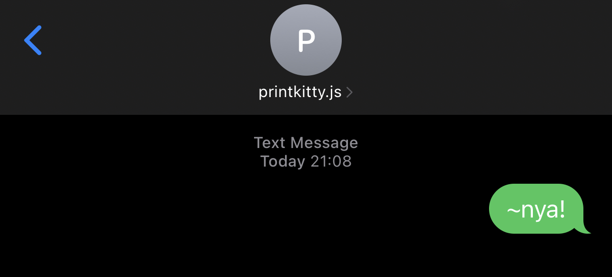

# printkitty.js sms service

## What is this?

This is a small service that you can run, either locally (if you've got a static IP/DDNS setup) or in the cloud (e.g Heroku) to act as a SMS gateway for [printkitty.js](https://github.com/mickwheelz/printkitty.js).

**TLDR;** your cat printer can now receive and print SMSs

## How does it work?

It uses [twilio](https://www.twilio.com/) as a SMS gateway, [MongoDB](https://www.mongodb.com/) for storing the SMS and exposes a REST API that printkitty.js polls to handle the actual printing part.

TODO: Diagram

## How do I use it?

The service requires a public facing address in order to work with twilio, as well as a mongoDB instance. Both can be run locally if you have the appropriate network setup (static ip/dyn dns and port forwarding)

The simplest way however, is to deploy it to [Heroku](https://www.heroku.com) and use [MongoDB Atlas](https://www.mongodb.com/atlas/database) to host the database. The project can also be built with docker to be used with your cloud provider of choice (GCP, AWS, Azure, etc) or from within kubernetes, etc.

I will detail using it with Heroku & MongoDB Atlas below. If you use another method, skip to the 'Twilio Setup' section

Once you've got the service up and running, follow the steps in the repo here to setup printkitty.js running on your local machine.

### MongoDB Atlas Setup

You will need a MongoDB Atlas account, you can get one [here](https://www.mongodb.com/cloud/atlas/register)

Once registered, follow the below steps

1. Create a Org and Cluster, the 'Shared' clusters are free
2. Choose a cloud provider and region, ideally the one closest to where your service is hosted
3. Give the cluster a name and accept the default options and set a user/password
4. Grant access to your cluster, this is done by IP address
5. Once its created, click the 'Connect' button, then 'Connect Your Application' 
6. Get the connection string, replace `<password>` with the password set earlier.

This connection string will be used in the `MONGO_DB_URL` environment variable of your service.

### Deploying to Heroku

You will need to create a Heroku account, you can do that for free [here](https://signup.heroku.com/).

You now can simply click this button to deploy then follow the steps after 'Once Deployed'

If you wish to deploy it yourself, follow the below steps

1. Select New > Create New App
2. Give it a name, select a region and press 'Create App'
3. You can either use the heroku CLI or GitHub to deploy, I will use GitHub in this example
4. Go to github and fork this repo
5. In Heroku, select 'Connect to GitHub' and authorise your GitHub account
6. Search for the forked repository, then press 'Connect'
7. You can now scroll to the 'Manual deploy' section and hit 'Deploy Branch', you can also configure automatic deployments if you wish

#### Once deployed

1. Under the 'Settings' tab, scroll to 'Config Vars'. You will need to set them as detailed in the 'Environment Variables' section as below. The `MONGO_DB_URL`, `AUTH_USERNAME` and `AUTH_PASSWORD` must be set. Heroku will set the `PORT` and the other variables are optional.

`MONGO_DB_URL` must be set to the value from the 'mongoDB Atlas Setup' section above.

### Twilio Setup

You will need to create a free trial account with twilio [here](https://www.twilio.com/try-twilio). Twilio provides you with a free US based number to use, you can also buy local numbers if you wish.

Once you have created an account and signed in;

1. Go to Develop > Phone Numbers > Manage > Active Numbers
2. Select the number and then scroll to the 'Messaging' section
3. Under 'A MESSAGE COMES IN' select 'Webhook' and enter the URL of your hosted service (e.g `https://<user>:<pass>@mycoolservice.herokuapp.com/handleInboundSMS`). The `<user>` and `<pass>` in the URL are the values you set in the `AUTH_USERNAME` and `AUTH_PASSWORD` environment variables
4. Click 'Save'

You should now be able to send SMS to the number and have them saved in the service. You can check them by making a `GET` request to `<service>/getSMS/PENDING`

If they do not seem to be appearing in the database, check the twilio logs by going to Monitor > Logs > Errors > Error Logs.

For more on Twilio SMS webhooks, see the docs [here](https://www.twilio.com/docs/usage/webhooks/sms-webhooks)

### Environment Variables

The following enviornemnt variables need to be set in order to use the service. This can either be done in the usual fashion (`export ...`), via your cloud provider or using [dotenv](https://www.npmjs.com/package/dotenv)

| Variable    | Description | Example |
|-------------|-------------|---------|
|MONGO_DB_URL |The full connection url to your mongoDB instance |"mongodb://localhost/printkittySMS"|
|AUTH_USERNAME|The username to use for the REST API |"admin"|
|AUTH_PASSWORD|The password to use for the REST API |"secret"|
|PORT  |The port for the REST API to run on, default 3000 |6969|
|LOG_LEVEL | The logging level to use, default 'info' | "debug" |

### API Reference

The service exposes the following endpoints.

|Endpoint|Method|Description|Example|
|--------|------|-----------|-------|
|`/health`|`GET`|Health check for k8s, etc| `GET /health` | |
|`/getSMS/:status`|`GET`|Gets all SMS for a given status| `GET /getSMS/PENDING` | TODO |
|`/getSMS`|`GET`|Gets all SMS in the DB | `GET /getSMS` | TODO |
|`/handleInboundSMS`|`POST`|Accepts incoming SMS from twilio| `POST /handleInboundSMS?From=%2B447000111000&Body=text&...` |
|`/updateSMSStatus/:id`|`POST`|Updates a single SMS with the given payload| `POST /updateSMSStatus/62c3308c478f3811b45db688 `   `Body: {"status":"ERROR"}` |
|`/updateSMSStatus`|`POST`| Updates multiple SMSs with the given payload | TODO |
